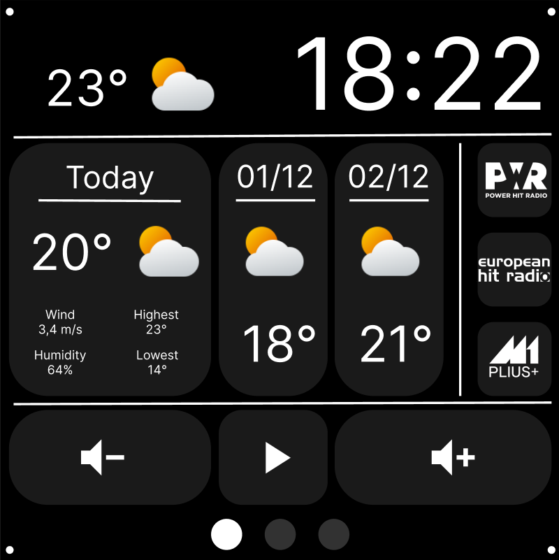
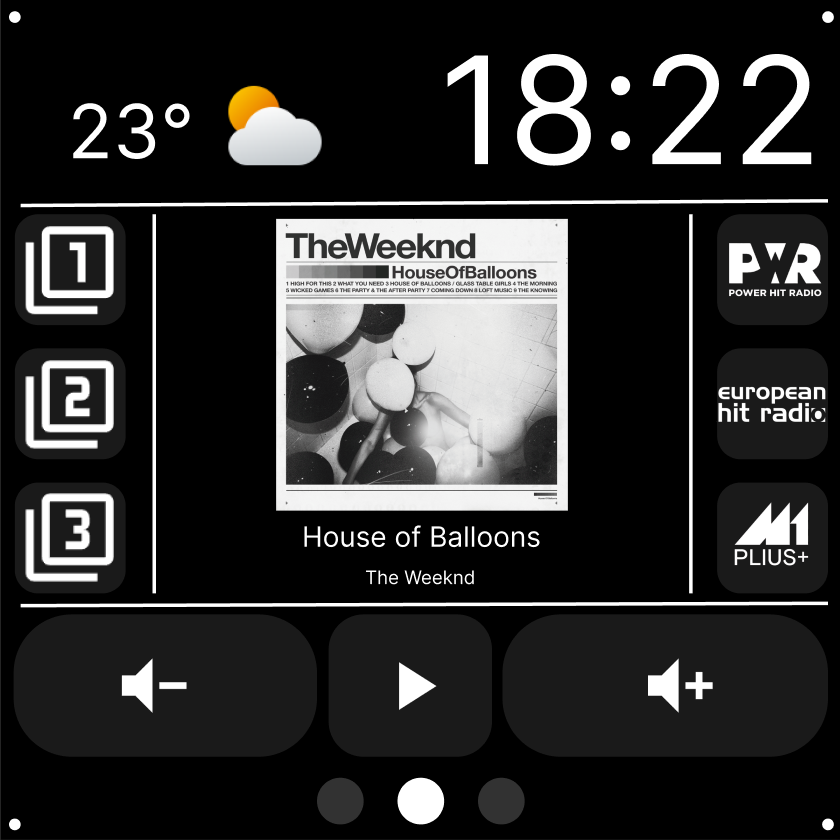
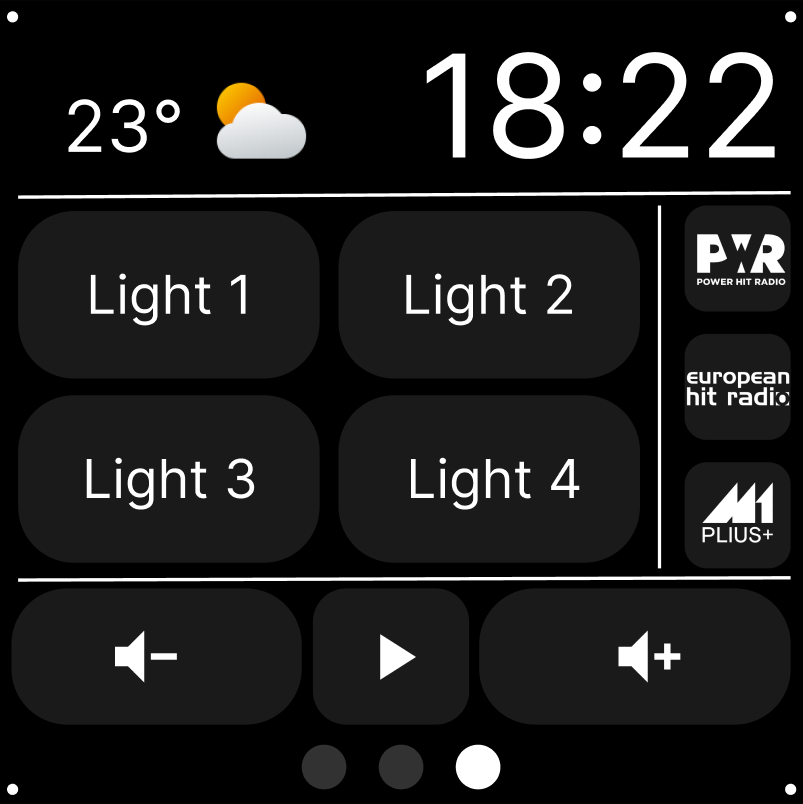

# Smart Box V1

> A comprehensive ESPHome configuration for the ESP32-P4 Smart 86-Box, transforming it into a powerful voice-controlled smart home control panel.

[](https://esphome.io/)
[](https://www.home-assistant.io/)

## Compatible Devices

This configuration works with the following devices:

- **ESP32-P4-86-Panel-ETH-2RO** - Wall-mounted 86-box panel
- **ESP32-P4-WIFI6-Touch-LCD-4B** - WiFi6 touch LCD panel
  - [Purchase from Waveshare](https://www.waveshare.com/esp32-p4-wifi6-touch-lcd-4b.htm)

Both devices share the same ESP32-P4 core and display specifications, making this firmware compatible with either device.

## Table of Contents

- [Compatible Devices](#compatible-devices)
- [Overview](#overview)
- [Key Features](#key-features)
- [Screenshots](#screenshots)
- [Hardware Requirements](#hardware-requirements)
- [Configuration](#configuration)
- [Installation Prerequisites](#installation-prerequisites)
- [Installation](#installation)
- [Screen Navigation](#screen-navigation)
- [Voice Assistant](#voice-assistant)
- [Home Assistant Configuration](#home-assistant-configuration)
- [Troubleshooting](#troubleshooting)
- [Customization](#customization)
- [Contributing](#contributing)
- [Support](#support)

## Overview

Smart Box V1 is a comprehensive ESPHome configuration for the ESP32-P4 Smart 86-Box device. It features a 720x720 MIPI-DSI display with touch control, voice assistant capabilities, and seamless integration with Home Assistant. The device functions as a wall-mounted smart home control panel with weather information, media control, and home automation.

## Key Features

### 🎙️ Voice Control
- **Multi-Wake Word Support**: okay_nabu, hey_jarvis, and alexa
- **On-Device Processing**: Fast, responsive wake word detection using Micro Wake Word
- **Home Assistant Integration**: Full voice assistant pipeline support
- **Audio DAC/ADC**: High-quality ES8311 DAC and ES7210 ADC for audio

### 📱 Smart Display Screens

**Main Screen - Weather Dashboard**
- Current time display (large format)
- Current temperature and weather conditions
- Today's high/low temperature forecast
- Tomorrow's weather forecast with conditions
- Day after tomorrow's forecast
- Quick access to radio stations
- Media playback controls

**Music Screen - Entertainment Hub**
- Now playing information (title and artist)
- Album art display (supports dynamic updates from media player)
- Volume and playback controls
- Quick-play radio station buttons
- Playlist preset buttons
- Full-screen album art view

**Home Control Page**
- Four customizable buttons for controlling Home Assistant entities
- Toggle lights, switches, or any toggleable entity
- Visual feedback showing button states
- Quick access to radio stations

**Settings Screen**
- Brightness control slider
- Volume control slider
- Device reboot button

### 🎯 Intuitive Controls
- **Swipe Navigation**: Swipe left/right to switch between screens
- **Swipe Down**: Open settings panel from any screen
- **Swipe Up**: Close settings panel
- **Touch Controls**: Full touch support for all buttons and sliders
- **Physical Integration**: ESP32-C6 WiFi co-processor for reliable connectivity

## Screenshots

Preview of the Smart Box V1 display screens:

| Weather Dashboard | Music Player | Home Control |
|:-----------------:|:------------:|:------------:|
|  |  |  |
| Current weather with 3-day forecast | Album art and media controls | 4 customizable light/switch buttons |

## Hardware Requirements

Designed for the ESP32-P4 Smart 86-Box and compatible devices (see [Compatible Devices](#compatible-devices)) with:
- **ESP32-P4 microcontroller** - 400MHz CPU with 32MB flash
- **ESP32-C6 WiFi co-processor** - Dedicated WiFi handling
- **MIPI-DSI Display** (720x720) - High-resolution square display
- **GT911 Touch Controller** - Capacitive multi-touch input
- **ES8311 Audio DAC** - High-quality audio output
- **ES7210 Audio ADC** - Microphone input
- **I2S Audio Bus** - Full audio pipeline

### Pin Configuration
| Function | Pin |
|----------|-----|
| I2C SDA | GPIO7 |
| I2C SCL | GPIO8 |
| I2S MCLK | GPIO13 |
| I2S LRCLK | GPIO10 |
| I2S BCLK | GPIO12 |
| I2S DIN (Mic) | GPIO11 |
| I2S DOUT (Speaker) | GPIO9 |
| Backlight | GPIO26 |
| Audio Amp | GPIO53 |

## Configuration

### Required Home Assistant Entities

Edit the substitutions section in `smart-box-v1.yaml` to set your entities:

```yaml
substitutions:
  # Device Identity
  name: smart-box-v1
  friendly_name: "Smart Box V1"

  # Weather Configuration
  weather_entity: "weather.forecast"  # Your weather entity

  # Media Player Configuration
  default_media_player: "media_player.your_media_player"
  now_playing_album_art: "sensor.now_playing_album_art"

  # Radio Stations (customize with your content IDs)
  radio_1_content_id: "library://radio/1"
  radio_1_name: "Radio 1"
  radio_2_content_id: "library://radio/2"
  radio_2_name: "Radio 2"
  radio_3_content_id: "library://radio/3"
  radio_3_name: "Radio 3"

  # Playlists
  playlist_1_content_id: "library://playlist/1"
  playlist_1_name: "Playlist 1"
  playlist_2_content_id: "library://playlist/2"
  playlist_2_name: "Playlist 2"
  playlist_3_content_id: "library://playlist/3"
  playlist_3_name: "Playlist 3"

  # Physical Buttons - Map to your HA entities
  button_1_entity: "light.living_room"
  button_2_entity: "light.bedroom"
  button_3_entity: "light.kitchen"
  button_4_entity: "light.bathroom"
```

### WiFi Configuration

Create a `secrets.yaml` file with your WiFi credentials:

```yaml
wifi_ssid: "your_wifi_ssid"
wifi_password: "your_wifi_password"
```

## Installation Prerequisites

Before installing Smart Box V1, ensure you have:

1. **Home Assistant Server** - Running and accessible on your network
   - Version 2024.1 or newer recommended
   - Voice assistant pipeline configured (optional, for voice features)

2. **ESPHome** - Version 2025.8.0 or newer
   - Install via: Settings → Add-ons → Add-on Store → ESPHome
   - Or use standalone ESPHome installation
   - Documentation: https://esphome.io/guides/getting_started_hassio/

3. **Compatible ESP32-P4 Device** - See [Compatible Devices](#compatible-devices) for supported hardware

4. **USB Cable** - For initial firmware flash (USB-C)

5. **2.4GHz WiFi Network** - ESP32 requires 2.4GHz (not 5GHz)

6. **Home Assistant Template Sensors** - Required for weather forecasts and album art
   - See [Home Assistant Configuration Guide](HA_CONFIGURATION.md)

## Installation

### Option 1: Via ESPHome Dashboard

1. Copy `smart-box-v1.yaml` to your ESPHome configuration directory
2. Create or update your `secrets.yaml` with WiFi credentials
3. Edit the substitutions section with your entity IDs
4. Create required Home Assistant sensors (see [HA_CONFIGURATION.md](HA_CONFIGURATION.md))
5. In ESPHome dashboard, click "Install" and choose your installation method:
   - **Wirelessly** (if device is already running ESPHome)
   - **Plug into this computer** (for USB installation)
   - **Manual download** (to download the firmware file)

### Option 2: Via Command Line

1. **Configure Entities**: Edit the substitutions section in `smart-box-v1.yaml`

2. **Setup WiFi Credentials**: Create a `secrets.yaml` file:
   ```yaml
   wifi_ssid: "your_wifi_ssid"
   wifi_password: "your_wifi_password"
   ```

3. **Compile Firmware**:
   ```bash
   esphome compile smart-box-v1.yaml
   ```

4. **Locate Firmware File**: Find `firmware.factory` in:
   - Windows: `.esphome\build\smart-box-v1\.pioenvs\smart-box-v1\`
   - Linux/Mac: `.esphome/build/smart-box-v1/.pioenvs/smart-box-v1/`

5. **Flash Device**:
   - Visit https://web.esphome.io/ in Chrome or Edge
   - Connect device via USB
   - Click "Install" and select the `firmware.factory` file
   - Wait for the flash process to complete

6. **Verify**: Device should connect to WiFi and appear in Home Assistant

## Screen Navigation

### Main Screen (Weather Dashboard)
- **Time Display**: Large clock showing current time
- **Weather**: Current conditions, temperature, and humidity
- **Forecast**: Today's high/low, tomorrow's and day after tomorrow's forecasts
- **Radio Buttons**: Quick access to 3 radio stations
- **Playback Controls**: Volume down, play/pause, volume up

### Music Screen (Media Control)
- **Now Playing**: Song title and artist from your media player
- **Album Art**: Dynamic album art (click to view full-screen)
- **Playlist Buttons**: 3 preset playlist shortcuts (left side)
- **Radio Buttons**: 3 preset radio station shortcuts (right side)
- **Playback Controls**: Same as main screen

### Home Control Page
- **4 Buttons**: Toggle Home Assistant entities
- **Visual Feedback**: Buttons change color based on entity state
- **Radio Buttons**: Quick access to radio stations

### Settings Screen
- Swipe down from any screen to access
- **Brightness Slider**: Adjust display backlight
- **Volume Slider**: Adjust media player volume
- **Reboot Button**: Restart the device

## Voice Assistant

The device supports multiple wake words:
- **okay_nabu** - Primary wake word
- **hey_jarvis** - Alternative wake word
- **alexa** - Familiar wake word option

### Voice Assistant Modes
- **On Device**: Uses Micro Wake Word for local processing (default)
- **In Home Assistant**: Uses Home Assistant's wake word processing

Voice commands are processed through Home Assistant's voice assistant pipeline.

## Home Assistant Configuration

Smart Box V1 requires several template sensors to be created in Home Assistant for:
- Weather forecast data (today, tomorrow, day after tomorrow)
- Now playing album art URL
- Media player information

**See [HA_CONFIGURATION.md](HA_CONFIGURATION.md) for complete setup instructions.**

## Troubleshooting

### Device Won't Connect to WiFi
- Verify WiFi credentials in `secrets.yaml`
- Check that WiFi network is 2.4GHz
- Ensure ESP32-C6 co-processor is functioning

### Voice Assistant Not Responding
- Ensure Home Assistant voice assistant is configured
- Check microphone is working (test in HA voice assistant settings)
- Verify wake word models are available
- Check ESPHome logs for errors

### Display Issues
- Verify display connection
- Check backlight GPIO configuration
- Try adjusting brightness via settings

### Weather Not Showing
- Verify template sensors are created in Home Assistant
- Check that weather entity ID is correct
- Ensure `weather.get_forecasts` service is available
- See [HA_CONFIGURATION.md](HA_CONFIGURATION.md) troubleshooting section

### Album Art Not Loading
- Verify `now_playing_album_art` sensor is configured
- Check media player entity has `entity_picture` attribute
- Ensure device can reach your Home Assistant URL
- See album art sensor configuration in [HA_CONFIGURATION.md](HA_CONFIGURATION.md)

### Home Assistant Actions Permission Warning
If you see:
> "Smart Box V1 is not permitted to perform Home Assistant actions"

To resolve:
1. Go to **Settings** → **Devices & Services**
2. Click on **ESPHome** integration
3. Click the **cogwheel icon** (⚙️) next to your device
4. Enable **"Allow the device to perform Home Assistant actions"**
5. Save the changes

## Customization

### Adding Custom Radio Stations
Edit the substitutions to add your radio station content IDs:
```yaml
radio_1_content_id: "your_radio_url_or_id"
radio_1_name: "My Station"
```

### Custom Button Entities
Change the button entities to control any Home Assistant entity:
```yaml
button_1_entity: "switch.my_device"
button_2_entity: "script.my_automation"
```

### Weather Icons
Custom weather icons are located in `resources/weather-icons/96x96/`. You can replace them with your own 96x96 PNG images.

### Radio Station Logos
Add custom radio logos in `resources/playlist-radio-icons/` and update the image references in the YAML file.

## Contributing

Contributions are welcome! Please feel free to submit issues or pull requests for:
- Bug fixes
- New features
- Documentation improvements
- Hardware compatibility

## License

This project is open source. Please check the repository for specific license information.

## Acknowledgments

- Built with [ESPHome](https://esphome.io/)
- Integrates with [Home Assistant](https://www.home-assistant.io/)
- Uses [LVGL](https://lvgl.io/) for display rendering

## Support

For questions, issues, or feature requests:
- Open an issue on GitHub
- Check ESPHome documentation: https://esphome.io/
- Review Home Assistant voice assistant docs: https://www.home-assistant.io/voice_control/

---
