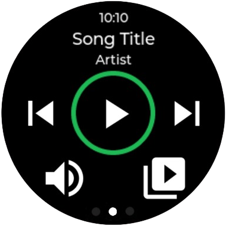
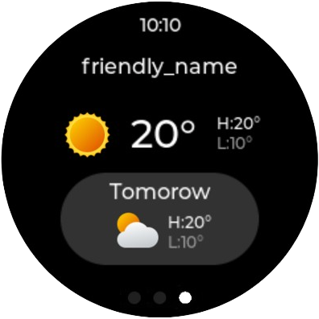

# OrbWare V1

> A feature-rich ESPHome configuration for the Xiaozhi Ball V2, transforming it into a powerful voice-controlled smart home display.

[](https://esphome.io/)
[](https://www.home-assistant.io/)

## Table of Contents

- [Overview](#overview)
- [Screenshots](#screenshots)
- [Key Features](#key-features)
- [Configuration](#configuration)
- [Installation Prerequisites](#installation-prerequisites)
- [Installation via PC](#installation-via-pc)
- [Installation via HA](#installation-via-ha)
- [Hardware](#hardware)
- [Screen Navigation](#screen-navigation)
- [Voice Assistant](#voice-assistant)
- [Troubleshooting](#troubleshooting)
- [Customization](#customization)
- [Contributing](#contributing)
- [Support](#support)

## Overview

OrbWare V1 is a comprehensive ESPHome configuration for the Xiaozhi Ball V2, focused on essential voice assistant functionality with media control and weather information. Transform your Xiaozhi Ball into a smart home hub with intuitive touch controls and voice commands.

This project is based on and inspired by the excellent work in [RealDeco/xiaozhi-esphome](https://github.com/RealDeco/xiaozhi-esphome). Many thanks to the original authors and contributors.

## Screenshots

<p align="center">
  
  
  
  
</p>

*From left to right: Main (Light Control), Media (Now Playing), Media (Volume), Weather Forecast*

## Key Features

### 🎙️ Voice Control
- **Multi-Wake Word Support**: Choose from okay_nabu (primary), hey_jarvis, or alexa
- **On-Device Processing**: Fast, responsive wake word detection
- **Home Assistant Integration**: Full voice assistant pipeline support

### 📱 Smart Display Screens

**Main Screen - Light Control**
- Toggle two individual lights
- Brightness slider for third light
- Visual feedback with intuitive icons

**Media Screen - Entertainment Hub**
- Now playing information display
- Volume control slider
- Quick-play button for favorite album/radio station
- Full playback controls (play, pause, skip)

**Weather Screen - At-a-Glance Forecast**
- Current weather conditions
- Real-time temperature
- Multi-day forecast
- Dynamic weather icons

### 🎯 Intuitive Controls
- **Swipe Navigation**: Effortlessly swipe left/right between screens
- **Touch Sensor**: Quick touch for timer dismissal and interactions
- **Circular Display**: Optimized UI for 240x240 round screen

## Configuration

### Required Home Assistant Entities

Edit the substitutions section in `orbware-v1.yaml` to set your entities:

```yaml
substitutions:
  light_entity_1: "light.YOUR_LIGHT_ENTITY_1"
  light_entity_2: "light.YOUR_LIGHT_ENTITY_2"
  light_entity_3: "light.YOUR_LIGHT_ENTITY_3"
  weather_entity: "weather.YOUR_WEATHER_ENTITY"
  default_media_player: "media_player.YOUR_MEDIA_PLAYER"
  album_radio_content_type: "music"
  album_radio_content_id: "YOUR_CONTENT_ID_HERE"
```

### WiFi Configuration

Create a `secrets.yaml` file with your WiFi credentials:

```yaml
wifi_ssid: "your_wifi_ssid"
wifi_password: "your_wifi_password"
```

## Installation Prerequisites

Before installing OrbWare V1, ensure you have:

1. **Home Assistant Server** - Running and accessible on your network
  - Version 2023.11 or newer recommended
  - Voice assistant pipeline configured (optional, for voice features)

2. **ESPHome** - Installed on Home Assistant
  - Install via: Settings → Add-ons → Add-on Store → ESPHome
  - Or use standalone ESPHome installation
  - Documentation: https://esphome.io/guides/getting_started_hassio/

3. **Xiaozhi Ball V2 Device** - The hardware this firmware is designed for

4. **USB Cable** - For initial firmware flash (USB-C)

5. **2.4GHz WiFi Network** - ESP32 requires 2.4GHz (not 5GHz)


## Installation via PC

Follow these steps to install OrbWare V1 using your computer:

1. **Configure Entities**: Edit the substitutions section in `orbware-v1.yaml` with your Home Assistant entity IDs

2. **Setup WiFi Credentials**: Create a `secrets.yaml` file in the same directory with:
  ```yaml
  wifi_ssid: "your_wifi_ssid"
  wifi_password: "your_wifi_password"
  ```

3. **Compile Firmware**: Use ESPHome to compile the configuration:
   ```bash
   esphome compile orbware-v1.yaml
   ```

4. **Locate Firmware File**: Find `firmware.factory` in:
  - Windows: `.esphome\build\orbware-v1\.pioenvs\orbware-v1\`
  - Linux/Mac: `.esphome/build/orbware-v1/.pioenvs/orbware-v1/`

5. **Flash Device**:
  - Visit https://web.esphome.io/ in Chrome or Edge
  - Connect Xiaozhi Ball via USB
  - Click "Install" and select the `firmware.factory` file
  - Wait for the flash process to complete

6. **Verify**: Device should connect to WiFi and appear in Home Assistant

## Installation via HA

1. Copy `orbware-v1.yaml` to your ESPHome configuration directory
2. Edit the substitutions section with your entity IDs
3. Create or update your `secrets.yaml` with WiFi credentials
4. In ESPHome dashboard, click "Install" and choose your installation method:
   - **Wirelessly** (if device is already running ESPHome)
   - **Plug into this computer** (for USB installation)
   - **Manual download** (to download the firmware file)
5. Once installed, the device will appear in Home Assistant for configuration

## Hardware

Designed for Xiaozhi Ball V2 hardware with:
- **ESP32-S3 microcontroller** - Dual-core processor with WiFi
- **GC9A01A circular display** (240x240) - Round TFT display
- **Touch sensor** - Capacitive touch input
- **Microphone and speaker** - For voice assistant functionality
- **RGB LED** - Visual feedback and notifications
- **Battery monitoring** - Track battery level and charging status

## Screen Navigation

### Main Screen (Light Control)
- **Switch 1 & 2**: Toggle individual lights
- **Brightness Slider**: Adjust third light brightness
- **Visual**: Shows current light states with icons

### Media Screen
- **Now Playing**: Displays current media information
- **Volume Control**: Adjust media player volume
- **Quick Play**: One-touch access to favorite album/radio
- **Playback Controls**: Play, pause, next, previous

### Weather Screen
- **Current Conditions**: Real-time weather status
- **Temperature**: Current temperature display
- **Forecast**: Upcoming weather predictions
- **Weather Icon**: Visual representation of conditions

## Voice Assistant

The device supports multiple wake words:
- **okay_nabu** (primary) - Custom wake word
- **hey_jarvis** - Alternative wake word
- **alexa** - Familiar wake word option

Voice commands are processed through Home Assistant's voice assistant pipeline, allowing you to:
- Control lights and devices
- Query weather information
- Control media playback
- Execute Home Assistant scripts and automations

## Troubleshooting

### Device Won't Connect to WiFi
- Verify WiFi credentials in `secrets.yaml`
- Check that WiFi network is 2.4GHz (ESP32 doesn't support 5GHz)
- Try resetting the device and reflashing

### Voice Assistant Not Responding
- Ensure Home Assistant voice assistant is configured
- Check microphone is working (test in HA voice assistant settings)
- Verify wake word models are installed
- Check ESPHome logs for errors

### Display Not Showing Correctly
- Verify display orientation settings in YAML
- Check display is properly connected
- Try adjusting brightness settings

### Entities Not Updating
- Confirm entity IDs in substitutions match your Home Assistant entities
- Check Home Assistant is reachable from the device
- Review ESPHome logs for API connection errors

### Home Assistant Actions Permission Warning
If you see this warning in Home Assistant:
> "OrbWare V1 is not permitted to perform Home Assistant actions
> Warning · Reported by ESPHome
> The ESPHome device attempted to perform a Home Assistant action, but this functionality is not enabled.
> 
> If you trust this device and want to allow it to perform Home Assistant action, you can enable this functionality in the options flow."

To resolve this:
1. Go to **Settings** → **Devices & Services**
2. Find and click on the **ESPHome** integration
3. Locate your OrbWare V1 device in the list
4. Click the **cogwheel icon** (⚙️) next to the device to open configuration
5. Enable the option **"Allow the device to perform Home Assistant actions"**
6. Save the changes

This permission is required for the device to control lights, media players, and other Home Assistant entities.

## Customization

### Adding Custom Screens
You can extend the configuration by adding new screens to the LVGL display configuration. Modify the `orbware-v1.yaml` file to include additional pages.

### Changing Wake Words
To use different wake words, update the wake word model files and references in the YAML configuration.

### Adjusting Display Layout
Modify the LVGL widget positions and styles in the YAML file to customize the appearance of each screen.

## Contributing

Contributions are welcome! Please feel free to submit issues or pull requests for:
- Bug fixes
- New features
- Documentation improvements
- Hardware compatibility

## License

This project is open source. Please check the repository for specific license information.

## Acknowledgments

- Built with [ESPHome](https://esphome.io/)
- Designed for Xiaozhi Ball V2 hardware
- Integrates with [Home Assistant](https://www.home-assistant.io/)
- Based on [RealDeco/xiaozhi-esphome](https://github.com/RealDeco/xiaozhi-esphome) — this project started from their base configuration and ideas. Thank you!

## Support

For questions, issues, or feature requests:
- Open an issue on GitHub
- Check ESPHome documentation: https://esphome.io/
- Review Home Assistant voice assistant docs: https://www.home-assistant.io/voice_control/

---

